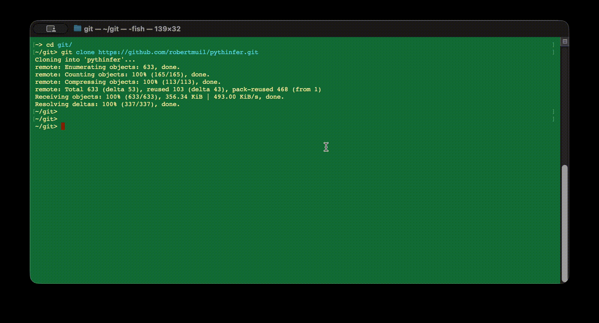

# pythinfer - Python Logical Inference

[](https://github.com/robertmuil/pythinfer/actions)
[](https://codecov.io/github/robertmuil/pythinfer)

*Pronounced 'python fur'.*

CLI to easily merge multiple RDF files, perform inference (OWL or SPARQL), and query the result.

Point this at a selection of RDF files and it will merge them, run inference over them, export the results, and execute a query on them. The results are the original statements together with the *useful* set of inferences (see below under `Inference` for what 'useful' means here).

A distinction is made between 'reference' and 'focus' files. See below.

## Quick Start

### Using `uv`

(in the below, replace `~/git` and `~/git/pythinfer/example_projects/eg0-basic` with folder paths on your system, of course)

1. Install `pythinfer` as a tool:

    ```bash
    uv tool install pythinfer
    ```

1. Clone the repository [OPTIONAL - this is just to get the example]:

   ```bash
   cd ~/git
   git clone https://github.com/robertmuil/pythinfer.git
   ```

1. Execute it as a tool in your project (or the example project):

    ```bash
    cd ~/git/pythinfer/example_projects/eg0-basic # or your own project folder
    uvx pythinfer query "SELECT * WHERE { ?s ?p ?o } LIMIT 10"
    uvx pythinfer query select_who_knows_whom.rq
    ```

    This will create a `pythinfer.yaml` project file in the project folder, merge all RDF files it finds, perform inference, and then execute the SPARQL query against the inferred graph.

1. To use a specific project file, use the `--project` option before the command:

    ```bash
    uvx pythinfer --project pythinfer_celebrity.yaml query select_who_knows_whom.rq
    ```

1. Edit the `pythinfer.yaml` file to specify which files to include, try again. Have fun.



## Command Line Interface

### Global Options

- `--project` / `-p`: Specify the path to a project configuration file. If not provided, pythinfer will search for `pythinfer.yaml` in the current directory and parent directories, or create a new project if none is found.
- `--verbose` / `-v`: Enable verbose (DEBUG) logging output.

### Common Options

- `--extra-export`: allows specifying extra export formats beyond the default trig. Can be used to 'strip' quads of their named graph down to triples when exporting (by exporting to ttl or nt)
  - NB: `trig` is always included as an export because it is used for caching
- ...

### `pythinfer create`

Create a new project specification file in the current folder by scanning for RDF files.

Invoked automatically if another command is used and no project file exists already.

### `pythinfer resolve-imports`

Finds any `owl:imports` statements in the given data files, resolves the URLs, downloads the content to local files, and adds the downloaded files to the project specification.

Intended for standalone usage, or as a utility for the `create` command, because resolving URLs at query time will introduce a requirement for network connectivity, time-outs, and caching challenges.

The full import closure is resolved: in other words, imports from files that are imported are included.

Downloaded content is saved locally and so is quick and reliable to access in further processing steps, but also the cache of content works because the local file's timestamps can be checked.

The command saves a mapping of URL (from the owl:imports statement) to local file path.

See [detailed documentation](docs/resolve-imports.md) for usage, file naming, and examples.

### `pythinfer merge`

Loads all data into a single Dataset, which is also persisted as `derived/<project_file_stem>/0-merged.trig`.

Largely a helper command, not likely to need direct invocation.

### `pythinfer infer`

Perform merging and inference as per the project specification, and export the resulting graphs to the output folder.

Results persisted as `derived/<project_file_stem>/1-inferred.trig` and `derived/<project_file_stem>/2-combined.trig`, and the latter is used as cache.

### `pythinfer query`

A simple helper command should allow easily specifying a query, or queries, and these should be executed against the latest full inferred graph.

In principle, the tool could also take care of dependency management so that any change in an input file is automatically re-merged and inferred before a query...

### `pythinfer explore`

Interactively browse triples in an RDF file or the project's inferred dataset. Opens a curses-based TUI with regex filtering, namespace editing, and more.

### `pythinfer compare`

Compare two RDF files side-by-side, showing their intersection, differences, and union in the same interactive TUI.

See [docs/tui.md](docs/tui.md) for full documentation of the TUI keybindings and features.

## Python API

In addition to the CLI, the library can be used directly from Python code.

The primary entry-point is an instance of `Project`. Once initialised, the project can be used to perform inference and access the full inferred graph, as well as the source data.

No state is stored in the `Project` instance, it is just a convenient interface. The data is loaded and created as-needed, either from source files or from the exports of inference, exactly as the CLI operates. In all cases, the data is loaded from disk.

This means that a client should keep the resultant dataset or graph itself in memory, rather than making multiple calls to the merge or infer methods of the `Project` instance, to avoid repeated loading from disk.

### Quick-start: querying full inferred data

```python
from pythinfer import Project

# Load and infer in one step from the first project discovered in current folder
ds = Project.discover().infer()

# Then you can do what you want with the Dataset
results = ds.query("SELECT * WHERE { GRAPH ?g { ?s ?p ?o } }")
print(f"Got {len(results)} results from Dataset.")

# Strip to a single Graph if named graphs not needed
from pythinfer.rdflibplus import reduce
g = reduce(ds)
results = g.query("SELECT * WHERE { ?s ?p ?o }")
print(f"Got {len(results)} results from Graph.")
```

### Initialising a Project

A project can be initialised from a project specification file, or directly specified.

The `path_self` argument is used to point to a file that is used for cache invalidation, so if the project is being directly specified, then a path to a real file can be given so that the cache still works. This file might be a config file in its own right, from which the pythinfer specification was derived, or it might be the source code file itself.

```python
from pythinfer import Project

# Load from a specific file
project = Project.from_yaml('path/to/pythinfer.yaml')

# Load from a discovered file (searches current and parent folders)
project = Project.discover()

# Specify directly in code
project = Project(
    name='Project From Python',
    focus=['data/file1.ttl'],
    reference=['vocabs/ref_vocab1.ttl'],
)

# Specify directly in code, but derived from another config file
cfg_file = "config.json"
myconfig = load_special_config(cfg_file)
project = Project(name="RDF part of {myconfig['title']}",
                  focus=myconfig["rdf_input_files"],
                  path_self=cfg_file)

# One can even point to the source file, if the packaging / installation
# of the downstream package allows access to it at run-time:
    ...
    path_self=__path__)
```

All of these return a `Project` instance. The `from_yaml()` and `discover()` methods will raise a `FileNotFoundError` if no project file is found.

### Merging and Inference

Access to the data is through the merge or infer methods, which return the merged and inferred datasets respectively. The inferred data will be loaded directly from disk if the exports under `derived/<project_file_stem>/` are up-to-date, otherwise inference will be performed.

```python
# Load the source files, returning the merged dataset.
ds_combined = project.merge()

# Load the source files and perform inference, returning the full resultant dataset.
ds_full = project.infer()
```

`merge()` and `infer()` return a `rdflib.Dataset` containing the merged and inferred data, optionally including named graphs for provenance.

A helper method, `reduce()` is also provided which returns a `rdflib.Graph` by stripping quads down to triples (i.e. dropping all named graph ids) which is commonly done to simplify downstream processing.

```python
from pythinfer.rdflibplus import reduce
g_full = reduce(ds_full)
```

## Project Specification

A 'Project' is the specification of which RDF files to process and configuration of how to process them, along with some metadata like a name.

Because we will likely have several files and they will be of different types, it is easiest to specify these in a configuration file (YAML or similar) instead of requiring everything on the command line.

The main function or CLI can then be pointed at the project file to easily switch between projects. This also allows the same sets and subsets of inputs to be combined in different ways with configuration.

### Project Specification Components

```yaml
name: (optional)
owl_backend: (optional, default 'owlrl')
focus:
    - <pattern>: <path to a 'focus' file>
    - ...
reference:
    - <pattern>: <path to a 'reference' file>
    - ...
sparql_inference:
    - <pattern>: <path to a SPARQL CONSTRUCT query file>
    - ...
```

#### Reference vs. Focus Data (was External vs. Internal)

Reference data is treated as ephemeral information used for inference and then discarded. Most commonly it is the vocabulary and data that is not maintained by the user, but whose axioms are assumed to hold true for the application. They are used to augment inference, but are not part of the data being analysed, and so they are not generally needed in the output.

Examples are OWL, RDFS, SKOS, and other standard vocabularies.

Synonyms for 'reference' here could be 'transient' or 'catalyst' or (as was the case) 'external'.

### Path Resolution

Paths in the project configuration file can be either **relative or absolute**.

**Relative paths** are resolved relative to the directory containing the project configuration file (`pythinfer.yaml`). This allows project configurations to remain portable - you can move the project folder around or share it with others, and relative paths will continue to work.

This means that the current working directory from which you execute pythinfer is irrelevant - as long as you point to the right project file, the paths will be resolved correctly.

**Absolute paths** are used as-is without modification.

#### Examples

If your project structure is:

```ascii
my_project/
├── pythinfer.yaml
├── data/
│   ├── file1.ttl
│   └── file2.ttl
└── vocabs/
    └── schema.ttl
```

Your `pythinfer.yaml` can use relative paths:

```yaml
name: My Project
focus:
  - data/file1.ttl
  - data/file2.ttl
reference:
  - vocabs/schema.ttl
```

These paths will be resolved relative to the directory containing `pythinfer.yaml`, so the configuration is portable.

You can also use absolute paths if needed:

```yaml
focus:
  - /home/user/my_project/data/file1.ttl
```

### Project Selection

The project selection process is:

1. **User provided**: path to project file provided directly by user on command line, and if this file is not found, exit
    1. if no user-provided file, proceed to next step
1. **Discovery**: search in current folder and parent folders for project file, returning first found
    1. if no project file discovered, proceed to next step
1. **Creation**: generate a new project specification by searching in current folder for RDF files
    1. if no RDF files found, fail
    1. otherwise, create new project file and use immediately

### Project Discovery

If a project file is not explicitly specified, `pythinfer` operates like `git` or `uv` in that it searches for a `pythinfer.yaml` file in the current directory, and then in parent directories up to a limit.

The limit on parent directories to search is:

1. don't traverse below `$HOME` if that is in the ancestral line
1. don't go beyond 10 parent folders

### Project Creation

If a project is not provided by the user or discovered from the folder structure, a new project specification will be created automatically by scanning the current folder for RDF files. If some RDF files are found, subsidiary files such as SPARQL queries for inference are also sought and a new project specification is created. This new spec will be saved to the current folder.

The user can also specifically request the creation of a new project file with the `create` command.

## Merging

Merging of multiple data files preserves the source, using the named graph of the quads.

Merging distinguishes 2 types of input:

1. *Reference* data: things like OWL, SKOS, RDFS, which are introduced for inference purposes, but are not maintained by the person using the library, and the axioms of which can generally be assumed to exist for any application.
   - the term reference is meant from the perspective of the user / application, much like the traditional notion of 'reference' data being that which is maintained elsewhere, as opposed to 'master' data.
2. *Focus* data: the graph data being developed, vocabularies (including ontologies) that are part of the current focus, as well as instance data - all of this should always be preserved in the output, and is the 'focus' of the inference.

## Inference

By default an efficient OWL rule subset should be used, currently OWL-RL.

### Invalid inferences

Some inferences, at least in `owlrl`, may be invalid in RDF - for instance, a triple with a literal as subject. These should be removed during the inference process.

### Unwanted inferences

In addition to the invalid inferences, many inferences are value-less. For example, every instance could be considered to be the `owl:sameAs` itself. This is semantically valid but useless to express as an explicit triple.

Several classes of these unwanted inferences can be removed by this package. Some can be removed per-triple during inference, others need to be removed afterwards by considering the whole graph.

#### Per-triple unwanted inferences

These are unwanted inferences that can be identified by looking at each triple in isolation:

1. redundant reflexives, such as `ex:thing owl:sameAs ex:thing`
1. many declarations relating to `owl:Thing`, e.g. `ex:thing rdf:type owl:Thing`
1. declarations that `owl:Nothing` is a subclass of another class (NB: the inverse is *not* unwanted as it indicates a contradiction)
1. triples with an empty string as object

#### Whole-graph unwanted inferences

These are unwanted inferences that can only be identified by considering the whole graph. Examples:

1. Undeclared blank nodes
   - blank nodes are often used for complex subClass or range or domain expressions
   - where this occurs but the declaration of the blank node is not included in the final output, the blank node is useless and we are better off removing any triples that refer to it
   - a good example of this is `skos:member` which uses blank nodes to express that the domain and range are the *union* of `skos:Concept` and `skos:Collection`
   - for now, a blank node 'declaration' is defined as any triple where the blank node is the subject

### Inference Process

Steps:

1. **Load and merge** all input data into a triplestore
    - Maintain provenance of data by named graph
    - Maintain list of which named graphs are 'reference'
    - output:        `merged`
    - consequence:   `current = merged`
2. **Generate reference inferences** by running RDFS/OWL-RL inference over 'reference' input data
    - Note that inference is backend dependent, and will include the removal of *invalid* triples that may result, e.g. from `owlrl`.
    - output:        `inferences_reference_owl`
3. **Generate full inferences** by running RDFS/OWL-RL inference over all data so far
    - See Note for Step 2.
    - output:        `inferences_full_owl`
    - consequence:   `current += inferences_full_owl`
4. **Run heuristics** over all data
    - output:        `inferences_sparql` + `inferences_python`
    - consequence:   `current += inferences_sparql` + `inferences_python`
5. **Repeat steps 3 through 4** until no new triples are generated, or limit reached
    - consequence:   `combined_full = current`
6. **Subtract reference data and reference inferences** from the current graph
    - Note: this step logically applies, but in the `owlrl` implementation we can simply avoid including the reference_owl_inferences graph in the output, since `owlrl` will not generate inferences that already exist.
    - consequence:   `current -= (reference_data + inferences_reference_owl)`
    - consequence:   `combined_focus = current`
7. **Subtract all 'unwanted' inferences** from result
    - Note: unwanted inferences are those that are semantically valid but not useful, see below.
    - consequence:   `combined_wanted = current - inferences_unwanted`

### Backends

#### `rdflib` and `owlrl`

In rdflib, the `owlrl` package should be used.

This package has some foibles. For instance, it generates a slew of unnecessary triples. The easiest way to remove these is to first run inference over all reference vocabularies, then combine with the user-provided vocabularies and data, run inference, and then remove all the original inferences from the reference vocabularies from the final result. The reference vocabularies themselves can also be removed, depending on application.

Unwanted inferences are generated even when executed over an empty graph.

#### `pyoxigraph`

No experience with this yet.

#### Jena (`riot` etc.)

Because Jena provides a reference implementation, it might be useful to be able to call out to the Jena suite of command line utilities (like `riot`) for manipulation of the graphs (including inference).

#### Heuristics (SPARQL, Python, etc.)

Some inferences are difficult or impossible to express in OWL-RL. This will especially be the case for very project-specific inferences which are trivial to express procedurally but complicated in a logical declaration.

Therefore we want to support specification of 'heuristics' in other formalisms, like SPARQL CONSTRUCT queries and Python functions.

The order of application of these heuristics may matter - for instance, a SPARQL CONSTRUCT may create triples that are then used by a Python heuristic, or the former may require the full type hierarchy to be explicit from OWL-RL inference.

Thus, we apply heuristics and OWL-RL inference in alternating steps until no new triples are generated.

## Provenance

Within the merged and inferred Datasets, the named graph is used to indicate the source of the data.

Details about the source - i.e. metadata about the named graph - are included in a separate provenance graph which is persisted separately from the merged and inferred data.

This provenance graph should include information about the source of the data, the inference steps that were applied, and the details of the inference steps such as the version and parameters of the inference engine.

Separate provenance graphs should be generated for the merge step and the inference step, and these should be persisted separately. The combined graph export, which is used as a cache, *does* include provenance graphs to simplify cache operation.

We do not want the provenance information included in the main exports or the main dataset returned by the API by default because it would be confusing for consumers if triples are added which were not present in the source data nor generated by inference from them.

That is: by default if a consumer loads one of the exported files, or retrieves the dataset via the API, they get only the original triples and/or the inferential closure of those triples, *not* the provenance.

To get provenance, one must explicitly load the provenance file, or add `include_provenance=True` in the API.

## Data Structures

### DatasetView

Intended to give a restricted (filtered) view on a Dataset by only providing access to explicitly selected graphs, enabling easy handling of a subset of graphs without copying data to new graphs.

Specifications:

1. A DatasetView may be read/write or readonly.
1. Graphs MUST be explicitly included to be visible, otherwise they are excluded (and invisible).
1. Attempted access to excluded graphs MUST raise a PermissionError.
1. Any mechanism to retrieve triples (e.g.: iterating the view itself, or using `triples()` or using `quads()`) that does not explicitly specify a named graph (e.g. `triples()` called without a `context` argument) MUST return triples from all included graphs, not just the default graph.
1. Default graph MUST therefore be excluded if the underlying Dataset has `default_union` set (because otherwise this would counterintuitively render triples from excluded graphs visible to the view).
1. A DatasetView SHOULD otherwise operate in exactly the same way as the underlying Dataset.

#### Inclusion and Exclusion of Graphs

`rdflib`'s handling of access, addition, and deletion of named graphs has some unintuitive nuance. See [this issue](https://github.com/robertmuil/rdflib/issues/18) for the most relevant example.

For the View, we want to adopt as little difference to APIs and expectations as possible, which unfortunately means taking on the unintuitive behaviours.

So, there are *no* methods for including or excluding a graph once a view is created, because the behaviour of such methods would be very difficult to define. If the included graphs needs to be changed, a new DatasetView should simply be created, which is light-weight because no copying is involved.

#### Adding and Removing Content

Adding a new graph is not possible through the View unless it was in the list of included graphs at construction, because it only allows accessing included graphs. If an identifier is in the original included list, but has no corresponding triples in the underlying triplestore, this is allowed, and subsequent addition of a triple against that graph identifier would defacto essentially be the 'addition' of a graph to the store.

Removing a graph likewise performs exactly as if performed on the underlying Dataset, unless the graph's identifier is not in the inclusion list, in which case it generates a `PermissionError`. In either case, the graph remains in the inclusion list.

Adding and removing triples is possible (unless the View is set to read-only, which may not be implemented) as long as the triples are added to a graph in the inclusion list.

Adding or removing a triple without specifying the graph would go to the default graph and the same check applies: if the default graph is in the inclusion list, this is allowed, otherwise it will raise a `PermissionError`.

This is all following the principle of altering the API of `Dataset` as little as possible.

## Real-World Usage

The `example_projects` folder contains contrived examples, but this has also been run over real data:

1. [foafPub](https://ebiquity.umbc.edu/resource/html/id/82/foafPub-dataset)
   1. takes a while, but successfully completes
   2. only infers 7 new useful triples, all deriving from an `owl:sameAs` link to an otherwise completely unconnected local id (treated as a blank node)
1. [starwars](https://platform.ontotext.com/semantic-objects/_downloads/2043955fe25b183f32a7f6b6ba61d5c2/SWAPI-WD-data.ttl)
   1. successfully completes, reasonable time
   2. infers 175 new triples from the basic starwars.ttl file, mainly that characters are of type `voc:Mammal` and `voc:Sentient` or `voc:Artificial`, etc.
      1. also funnily generates `xsd:decimal owl:disjointWith xsd:string`
   3. including `summary.ttl` doesn't change the inferences, which I think is correct.

## Next Steps

1. implement pattern support for input files
1. allow Python-coded inference rules (e.g. for path-traversal or network analytics)
    - also use of text / linguistic analysis would be a good motivation (e.g. infer that two projects are related if they share similar topics based on text analysis of abstracts)
1. implement base_folder support - perhaps more generally support for specification of any folder variables...
1. consider using a proper config language like dhal(?) instead of yaml
1. check and raise error or at least warning if default_union is set in underlying Dataset of DatasetView
1. document and/or fix serialisation: canon longTurtle is not great with the way it orders things, so we might need to call out to riot unfortunately.
1. add option to remove project name from named graphs, for easier specification:
   1. e.g. `<urn:pythinfer:inferences:owl>` which is easy to remember and specify on command-line.
1. filters!
    - add option to specify s(subject), p(predicate), o(object) in the search, and then the search will only match against that part of the triple, allowing for more focused filtering
1. add TUI for queries
   1. allow easy loading of existing SPARQL query files
   2. automatically add a LIMIT to the query if not already present, to prevent accidental execution of very expensive queries
   3.
