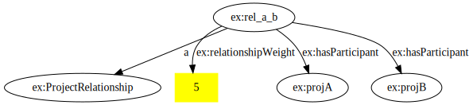
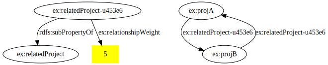

# EG2 - Projects

NB: if this matures, we might move the model into a more prominent and utilised place rather than just being an example.

We are treating the model as an external vocabulary to avoid the model-only inferences during testing. This is probably a good indication that we either need a concept of 'vocabulary-only' inference, or a way to separate model and data in the same graph, or just better name for 'external'.

## Supported Tests

### Related Projects - Complex Inference with SPARQL

Determine a weighted link between any two projects, based on multiple dimensions, and then apply a threshold to decide if they should be considered 'Related'

For the example here, we can define the threshold like this:
Either:

1. 5 or more shared external vocabularies;
2. OR 2 shared internal vocabulary;
3. OR 1 shared internal and 2 shared external vocabularies.

This would be equivalent to:

1. Each shared external vocabulary is worth 1
2. Each shared internal vocabulary is worth 3
3. Threshold is 5 or more

Further:
4. A dataset is considered the same if it has identical `dct:isVersionOf` or, if that is not defined, then identical `ptp:inputPattern`.

This example uses blank nodes for the projects, so the inference must first determine `owl:sameAs` links, based on rule 4 above. They share 2 external vocabs (SKOS and PROVO, defined with their `dct:isVersionOf`) and they share a single internal data source (defined with the data/*.ttl `ptp:inputPattern`). They should have a relationship weight of 5 (3 for the internal, and 1 each for the externals), and the shared data source IRIs should be 6 - because each of the 3 data sources is duplicated with a different blank node in each project.

Input:

```turtle
eg:projA a ptp:Project ;
    ptp:hasInternalData [
        a ptp:DataFile ;
        ptp:inputPattern "data/*.ttl" ;
        dct:title "Project Data Files"
    ] ;  # _:b0
    ptp:hasExternalData [
        a ptp:VocabularyFile ;
        ptp:inputPattern "vocabularies/skos.ttl" ;
        dct:title "SKOS Reference Vocabulary" ;
        dct:isVersionOf <http://www.w3.org/2004/02/skos/core>
    ] ;  # _:b1
    ptp:hasExternalData [
        dct:isVersionOf <http://www.w3.org/ns/prov#>
    ] ;  # _:b2

eg:projB a ptp:Project ;
    ptp:hasInternalData [
        ptp:inputPattern "data/*.ttl" ;
        dct:title "All the internal stuff"
    ] ;  # _:b3
    ptp:hasExternalData [
        dct:isVersionOf <http://www.w3.org/2004/02/skos/core>
    ] ;  # _:b4
    ptp:hasExternalData [
        dct:title "PROV-O Provenance Ontology"@en ;
        dct:isVersionOf <http://www.w3.org/ns/prov#>
    ] ;  # _:b5
    ptp:hasExternalData [
        dct:title "Friend-of-a-Friend (FOAF)"@en ;
        dct:isVersionOf <http://xmlns.com/foaf/0.1/>
    ] ;  # _:b6
```

Output of SPARQL inference:

```turtle
[] a ptp:ProjectRelationship ;
    ptp:hasParticipant eg:projA, eg:projB ;
    ptp:relationshipWeight 5 ;
    ptp:sharedDataSource _:b0, _:b1, _:b2, _:b3, _:b4, _:b5;
    .
```

### Flattening Related Projects - OWL-RL inference to simplify querying

Projects are related via a reified `Project Relationship` node, which makes querying and traversal indirect.

The purpose of this is to use OWL-RL property-chain axioms to infer a direct link between projects, `ptp:relatedProject`, from the presence of the `Project Relationship` node.

Input:

```turtle
[] a ptp:ProjectRelationship ;
    ptp:hasParticipant eg:projA, eg:projB ;
    ptp:relationshipWeight 5 .
```

Output of inference:

```turtle
eg:projA ptp:relatedProject eg:projB .
eg:projB ptp:relatedProject eg:projA .
```

#### Directional Relationships

It may be desireable to have the relationships directional, if they are not commutative, which can be implemented as a sub-pattern of the above.

Model:

```turtle
ptp:ProjectDirectionalRelationship rdfs:subClassOf ptp:ProjectRelationship .
ptp:hasSource rdfs:subPropertyOf ptp:hasParticipant .
ptp:hasTarget rdfs:subPropertyOf ptp:hasParticipant .

ptp:ProjectSubsumption rdfs:subClassOf ptp:ProjectDirectionalRelationship .
```

Example:

```turtle
eg:a_subsumes_b a ptp:ProjectSubsumption ;
    ptp:hasSource eg:projA ;
    ptp:hasTarget eg:projB ;
    rdfs:comment "formally subsumed on 15th December 2024"@en ;
    .
```

### Single-use Properties

Use of a uniquely minted property to provide the reification of a relationship, allowing statements about the the relationship to just be asserted directly against the single-use property. This avoids or complements the need for n-ary relations or rdf:Statement style reification.

They would be made subProperties of the main property to make querying trivial, though it may be that an annotation property should be used to avoid overloading inference engines.

These single-use properties can be placed in a distinct named graph to make selection easier.

e.g. `ptp:relatedProject-u453e6 rdfs:subPropertyOf ptp:relatedProject`

Using the same example as above, and now preserving attributes of the relationship with a single-use property while flattening the n-ary relationship:

```turtle
eg:rel_a_b a ptp:ProjectRelationship ;
    ptp:hasParticipant eg:projA, eg:projB ;
    ptp:relationshipWeight 5 .
```



Output of inference:

```turtle
ptp:relatedProject-u453e6 ptp:relationshipWeight 5 ;
    rdfs:subPropertyOf ptp:relatedProject ;
    .

eg:projA ptp:relatedProject-u453e6 eg:projB .
eg:projB ptp:relatedProject-u453e6 eg:projA .
```



### Marking as Redundant the inference sources, such as reified relationships

Once a relationship is flattened, the original is no longer strictly necessary, especially for visualisation and direct forms of query.

So, it would be valuable to mark them as being redundant such that they can easily be excluded in export or visualisation.

This could be done with an annotation property, or by making all redundant classes subclass of a special class like `meta:RedundantClass` and properties subproperty of a special property like `meta:RedundantProperty`

If single-use properties are used, then the source of the redundancy can be captured - otherwise RDF reification would need to be used.
